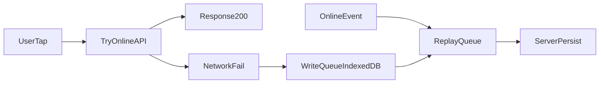

# AMD United HR — Phase 2 SDLC & Workflow Playbook

**Document type:** Engineering standard  
**Phase:** 2  
**Audience:** All engineers contributing CRUD, attendance, payroll-adjacent flows, and admin/employee portals.

This playbook defines **mandatory** patterns for new work. It complements [`APP_ARCHITECTURE.md`](APP_ARCHITECTURE.md). Where guidance conflicts on **server-backed data loading and caching**, **this document is authoritative for Phase 2** (TanStack Query is required for new data fetching; the Phase 1 rule against React Query is superseded **only** for that concern). All other structural rules in `APP_ARCHITECTURE.md` (feature folders, Radix, Tailwind v4, CVA, no Redux/Zustand for *arbitrary* global state, etc.) remain in force unless explicitly revised elsewhere.

---

## How to use this playbook

1. **Before design:** Identify which pillar(s) apply (offline attendance, multi-collection writes, request UI, data hydration).
2. **During implementation:** Follow the approved stacks and anti-patterns in each section.
3. **Before merge:** Complete the [PR checklist](#pr-checklist-phase-2).

**Repository anchors (map code to standards):**

| Concern | Location |
|--------|----------|
| Global admin data (Phase 1 monolith) | [`frontend/src/stores/DataContext.tsx`](frontend/src/stores/DataContext.tsx), [`frontend/src/api/admin.ts`](frontend/src/api/admin.ts) (`fetchAllData`) |
| HTTP + JWT | [`frontend/src/api/client.ts`](frontend/src/api/client.ts) (`request`, `upload`, `ApiError`) |
| Feature modules | [`frontend/src/features/`](frontend/src/features/) (`attendance`, `hr`, `organization`, …) |
| Shared UI primitives | [`frontend/src/components/`](frontend/src/components/) (e.g. [`frontend/src/components/ui/Button.tsx`](frontend/src/components/ui/Button.tsx) — **CVA** reference) |
| Express API | [`backend/routes/`](backend/routes/), [`backend/middleware/`](backend/middleware/) |
| Handlers (partial migration) | [`backend/controllers/`](backend/controllers/) (e.g. [`backend/controllers/attendanceController.js`](backend/controllers/attendanceController.js)) |
| Mongoose models | [`backend/models/`](backend/models/) — e.g. [`Record`](backend/models/Record.js), [`LeaveRequest`](backend/models/LeaveRequest.js), [`EarlyCheckout`](backend/models/EarlyCheckout.js), [`Overtime`](backend/models/Overtime.js), [`AdminNotification`](backend/models/AdminNotification.js) |
| Admin aggregate endpoint | [`backend/routes/admin.js`](backend/routes/admin.js) (`GET /all-data`) |
| Employee-scoped API | [`backend/routes/employee.js`](backend/routes/employee.js) |

---

## PR checklist (Phase 2)

- [ ] **Pillar 1 (if attendance / clock actions):** Offline path queues to IndexedDB; replay on reconnect; payload flags offline sync; no trusted-client-only event time for compliance decisions.
- [ ] **Pillar 2 (if touching multiple collections in one operation):** Mongoose transaction with `{ session }` on every write inside the callback; replica-set compatibility documented or env verified.
- [ ] **Pillar 3 (if Leave / Overtime / Early Checkout UI):** Uses shared `BaseRequest` typing and shared `StatusBadge`; **no** new discriminator-based merged collections.
- [ ] **Pillar 4 (all new reads/writes needing cache/dedup):** TanStack Query hooks + pagination contract where listing data; **no** new reliance on `fetchAllData` for that feature; **no** custom parallel TTL cache for the same data.
- [ ] Types remain **strict TypeScript** on the frontend; backend stays **JavaScript** per architecture unless a separate migration is approved.
- [ ] Tests or manual test notes updated when behavior is security- or payroll-critical.

---

## Pillar 1 — Usability: Offline-first attendance sync

### Standard

Construction sites often lack reliable connectivity. **Attendance check-in and check-out must remain usable offline:** the user gets immediate confirmation that the action is captured; synchronization to the server happens when the network is available.

### Approved stack

- **IndexedDB** accessed through a **small, approved wrapper**: [`idb`](https://github.com/jakearchibald/idb) **or** [`localforage`](https://github.com/localForage/localForage).
- **Team default:** prefer **`idb`** for a minimal API and straightforward typing in TypeScript. If a feature already standardized on `localforage`, do not introduce a second wrapper in the same feature without consolidation work.

### Queue contract

When `request()` (or attendance-specific wrapper) **fails** due to network error, `navigator.onLine === false`, or timeout policy defined for attendance:

1. Persist a **queue record** containing at minimum:
   - **idempotencyKey** (UUID, stable for the logical action)
   - **operation** (`checkIn` | `checkOut` | …)
   - **payload** (body you would have sent online)
   - **queuedAt** (ISO timestamp — metadata for ordering and support only)
2. Surface UI: “Saved on device — will sync when online.”

On **success** after replay, **remove** the queue entry. On **5xx**, apply **backoff** before retry; do not tight-loop the server.

### Security and auditability

> **Warning:** Do **not** treat the device’s `new Date()` (or any client clock) as the **sole** authoritative truth for compliance or payroll disputes. Client clocks can be wrong or manipulated.

**Required API semantics for offline-synced attendance:**

| Field | Responsibility |
|--------|----------------|
| `clientCapturedAt` | ISO string from device at time of user action (informational; still not trusted alone) |
| `syncedOffline` / `offlineSync: true` | Set on the payload when the record was **first** persisted via the offline queue (backend and Admin must be able to query and display this) |
| `serverReceivedAt` | Set **only** on the server when the write is successfully applied |

Admin surfaces and list filters **must** allow identifying offline-synced rows (badge, column, or filter).

### Replay and client integration

- Subscribe to **`window` `'online'`** (and optionally a periodic flush) to **replay** queued operations.
- Reuse the existing authenticated client: [`frontend/src/api/client.ts`](frontend/src/api/client.ts) **`request()`** for replayed calls so JWT and `401` handling stay consistent.

> **Warning — Idempotency:** Replay can run more than once (crash after server accepted but before client dequeue). The server **must** accept an **idempotency key** (header or body) and return a safe success or conflict response without creating **duplicate** `Record` rows for the same logical action.

### Reference flow



### Implementation note

[`backend/models/Record.js`](backend/models/Record.js) and existing attendance routes may not yet expose every field above. **Adding** `syncedOffline`, `serverReceivedAt`, and idempotency support is part of the feature work that implements this pillar—not optional documentation.

---

## Pillar 2 — Reliability: Atomic transactions for payroll data

### Standard

Any operation that **mutates more than one MongoDB collection** in a **single business transaction** (e.g. **Overtime** + **Record** + **AdminNotification**, or equivalent cross-collection payroll/adjustment flows) **must** be **atomic**: either all writes succeed or none do.

### Approved stack

- **Mongoose multi-document transactions:** `await mongoose.startSession()` (or connection-scoped session) plus **`session.withTransaction(async () => { ... })`**.
- Official pattern reference: [Mongoose transactions](https://mongoosejs.com/docs/transactions.html).

### Implementation rule

Inside the `withTransaction` callback, **every** persistence call that hits MongoDB **must** pass the session, including but not limited to:

- `Model.create([...], { session })`
- `doc.save({ session })`
- `Model.updateOne(filter, update, { session })`
- `Model.findOneAndUpdate(filter, update, { ...opts, session })`

**Reads** that must see a consistent snapshot within the same transaction should also use `{ session }` where applicable.

### Example pattern (backend JavaScript)

```javascript
const mongoose = require('mongoose');
const Record = require('../models/Record');
const Overtime = require('../models/Overtime');
const AdminNotification = require('../models/AdminNotification');

async function approveOvertimeAtomic(/* args */) {
  const session = await mongoose.startSession();
  session.startTransaction();
  try {
    await session.withTransaction(async () => {
      await Overtime.updateOne(
        { _id: overtimeId },
        { $set: { status: 'approved' /* ... */ } },
        { session },
      );
      await Record.updateOne(
        { _id: recordId },
        { $set: { overtimeMinutes: minutes /* ... */ } },
        { session },
      );
      await AdminNotification.create(
        [{ /* ... */ }],
        { session },
      );
    });
  } finally {
    await session.endSession();
  }
}
```

> **Warning — Replica set required:** MongoDB **transactions require a replica set** (e.g. **MongoDB Atlas** default topology). Standalone `mongod` for local dev **will fail** transactions. Document expected dev setup (Atlas dev cluster or local replica set) in the team runbook; do not merge transaction-based code without CI/env alignment.

### Scope

Apply this pillar to **new or refactored** multi-collection payroll paths. Incremental refactors should convert the highest-risk paths first (overtime approval, record + notification coupling, etc.).

---

## Pillar 3 — Reusability: Generic request UI (frontend only)

### Standard

**LeaveRequest**, **Overtime**, and **EarlyCheckout** share the same **administrative UX vocabulary** (status, employee, dates, actions). The UI must be **unified**; the database must stay **simple and explicit**.

### Frontend rules

1. **`BaseRequest` TypeScript interface**  
   Define a **canonical** interface (extend per feature as needed) in one agreed module, for example:

   - Recommended path: `frontend/src/features/hr/types/requests.ts`  
   (Alternative: `frontend/src/lib/types/requests.ts` if HR team prefers a neutral import — **pick one team-wide location** and import from there.)

   **Illustrative shape:**

   ```typescript
   export type RequestKind = 'leave' | 'overtime' | 'earlyCheckout'

   export interface BaseRequest {
     id: string
     kind: RequestKind
     status: string
     employeeId: string | { id?: string; name?: string; eid?: string }
     createdAt?: string
   }
   ```

   Domain types (`LeaveRequest`, `OvertimeEntry`, `EarlyCheckout` in [`frontend/src/api/admin.ts`](frontend/src/api/admin.ts) and feature types) should **extend** or **intersect** `BaseRequest` for list and detail components.

2. **`StatusBadge` (app-wide)**  
   Build a single component using **`class-variance-authority` (CVA)** with variants aligned to product language:

   - **Pending**
   - **Approved**
   - **Declined**

   Follow the same CVA style as existing primitives (see [`frontend/src/components/ui/Button.tsx`](frontend/src/components/ui/Button.tsx): `cva(...)`, `VariantProps`, `cn()` from `clsx` + `tailwind-merge`).

   Map backend enums consistently in a **thin adapter** (e.g. Mongoose `rejected` → Declined badge) so components do not branch on raw strings everywhere.

### Backend rules (strict)

- **Do not** introduce **Mongoose discriminators** or a merged “polymorphic requests” collection to unify Leave / Overtime / Early Checkout.
- **Keep** separate, explicit models, as today: [`LeaveRequest.js`](backend/models/LeaveRequest.js), [`EarlyCheckout.js`](backend/models/EarlyCheckout.js), [`Overtime.js`](backend/models/Overtime.js).

> **Warning:** UI reuse must **not** drive Mongo schema polymorphism. Over-engineered single-collection “request” abstractions create migration pain and unclear indexes.

---

## Pillar 4 — Scalability: Modular data hydration

### Standard

The monolithic **`fetchAllData`** pattern (single giant payload for the admin app) **does not scale** as employee and record counts grow. Phase 2 **deprecates** this pattern for **new features** and mandates **modular, cache-aware** data loading.

### Deprecation (Phase 2)

- **Deprecated for new work:** [`fetchAllData()`](frontend/src/api/admin.ts) and consuming everything through [`DataProvider` / `useData`](frontend/src/stores/DataContext.tsx) for **new** screens or **new** data dependencies.
- **Existing screens** may continue to use `DataContext` until migrated; **do not** add new domains to `AllDataResponse` without an architecture review.

### Approved stack

- **[TanStack Query (`@tanstack/react-query`)](https://tanstack.com/query/latest)** for all **new** server reads and mutation-driven invalidation.

### Implementation rules

1. **Provider:** Wrap the app (e.g. in [`frontend/src/App.tsx`](frontend/src/App.tsx)) with `QueryClientProvider` and a **single** `QueryClient` instance (or module-scoped singleton for tests).
2. **Feature hooks only:** Expose data through named hooks, e.g. `useEmployeesQuery`, `useAttendanceRecordsQuery`, colocated under:

   - `frontend/src/features/<domain>/hooks/`, and/or  
   - `frontend/src/features/<domain>/api/` (query functions beside `useQuery`).

   **Do not** introduce ad-hoc `fetch` + `useEffect` + `useState` caches for server lists that TanStack Query should own.

3. **Query keys:** Include every semantic input (`page`, `limit`, filters, sort) in the `queryKey`.

4. **Caching policy:** Rely on TanStack Query’s **`staleTime`**, **`gcTime`**, **`placeholderData` / `keepPreviousData`** (v5 naming) as appropriate. **Do not** build a **second** in-memory TTL cache for the same resources in Context or module globals.

5. **Mutations:** On success, **`invalidateQueries`** for affected keys; prefer targeted invalidation over global `invalidateQueries()` when possible.

> **Warning:** Holding the same server list in both **React Query** and **`DataContext`** for one resource creates **split-brain** UI. During migration, prefer a **cut-over** per route or per resource.

### Backend pagination contract

List endpoints used by TanStack Query **must** support standard pagination:

| Query param | Meaning |
|-------------|---------|
| `page` | 1-based page index (team convention; document if 0-based in a given route) |
| `limit` | Page size (cap at a max, e.g. 100, enforce server-side) |

**Recommended JSON shape:**

```json
{
  "data": [],
  "total": 0,
  "page": 1,
  "limit": 20
}
```

Implement in Express routes/controllers incrementally; **new** list APIs ship with this contract from day one.

### Illustrative hook (frontend)

```typescript
import { useQuery } from '@tanstack/react-query'
import { request } from '@/api/client'

type Page<T> = { data: T[]; total: number; page: number; limit: number }

export function useEmployeesQuery(page: number, limit: number) {
  return useQuery({
    queryKey: ['employees', { page, limit }],
    queryFn: () =>
      request<Page<Employee>>(`/employees?page=${page}&limit=${limit}`),
    staleTime: 60_000,
  })
}
```

*(Adjust endpoint paths to match actual Phase 2 routes.)*

### Dependencies

Add **`@tanstack/react-query`** (and **`idb`** or **`localforage`** per Pillar 1) to [`frontend/package.json`](frontend/package.json) when implementing—not before the feature needs them.

---

## SDLC workflow

### Branching and reviews

- Use **short-lived branches** per feature or fix; align name with ticket ID if applicable (`feature/ATT-123-offline-queue`).
- **Small PRs:** Prefer multiple reviewable PRs (types + API + UI) over one unreviewable batch.
- **Required reviewers** for payroll/offline/security: follow team roster; this playbook does not replace CODEOWNERS if configured later.

### Definition of Done

- Pillar requirements above satisfied where applicable.
- **No new** `fetchAllData` coupling for the feature’s primary data.
- **Lint and typecheck** pass (`frontend`: `npm run lint`, `tsc -b` / build as configured).
- **Backend:** tests in [`backend/test/`](backend/test/) extended when auth or transaction semantics change.

### Employee vs admin surfaces

Some employee routes mirror admin data shapes (see comments in [`backend/routes/employee.js`](backend/routes/employee.js)). When adding paginated or offline-aware APIs, ensure **authorization** and **scope** (employee vs admin) are explicit and tested.

### Documentation hygiene

After the team adopts Phase 2 patterns broadly, schedule an update to [`APP_ARCHITECTURE.md`](APP_ARCHITECTURE.md) so the “no React Query” line is replaced by a pointer to this playbook—**do not** leave contradictory docs indefinitely.

---

## Summary table

| Pillar | Topic | Must use |
|--------|--------|----------|
| 1 | Offline attendance | `idb` or `localforage`; queue; replay; offline flags + idempotency |
| 2 | Multi-collection payroll writes | `startSession` + `withTransaction` + `{ session }` on all writes |
| 3 | Request UX | `BaseRequest` + CVA `StatusBadge`; separate Mongoose models |
| 4 | Data hydration | TanStack Query; paginated list APIs; no duplicate custom caches |

---

*End of Phase 2 Workflow Playbook.*
